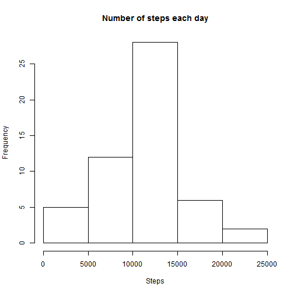
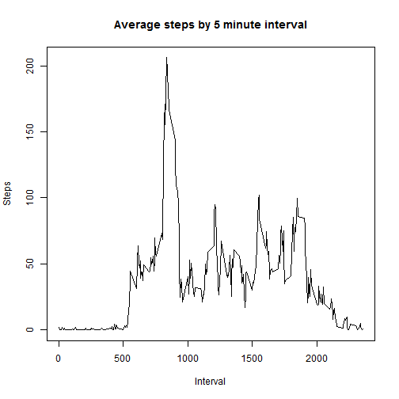
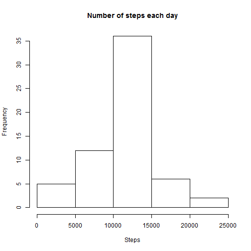
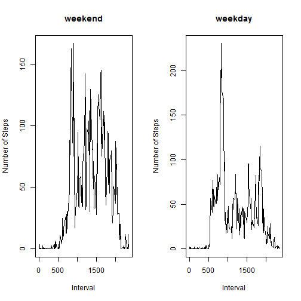

## Loading and preprocessing the data
Data must reside in the current working directory.


```r
activity <- read.csv("activity.csv");
summary(activity);
```

```
##      steps                date          interval     
##  Min.   :  0.00   2012-10-01:  288   Min.   :   0.0  
##  1st Qu.:  0.00   2012-10-02:  288   1st Qu.: 588.8  
##  Median :  0.00   2012-10-03:  288   Median :1177.5  
##  Mean   : 37.38   2012-10-04:  288   Mean   :1177.5  
##  3rd Qu.: 12.00   2012-10-05:  288   3rd Qu.:1766.2  
##  Max.   :806.00   2012-10-06:  288   Max.   :2355.0  
##  NA's   :2304     (Other)   :15840
```

## What is mean total number of steps taken per day?

1. Make a histogram of the total number of steps taken each day.


```r
activity_sum <- 
    aggregate( 
        cbind( steps ) ~ date , 
        data = activity , 
        FUN = sum ,
        na.rm = TRUE
    );
hist(activity_sum$steps,
     main="Number of steps each day",
     xlab="Steps"
     );
```

 

2. Calculate and report the mean and median total number of steps taken per day.


```r
mean(activity_sum$steps);
```

```
## [1] 10766.19
```

```r
median(activity_sum$steps);
```

```
## [1] 10765
```


## What is the average daily activity pattern?


1.Make a time series plot (i.e. type = "l") of the 5-minute interval (x-axis) and the average number of steps taken, averaged across all days (y-axis)


```r
activity_avg <- 
    aggregate( 
        cbind( steps ) ~ interval , 
        data = activity , 
        FUN = mean ,
        na.rm = TRUE
    );
plot(activity_avg$interval, 
     activity_avg$steps, 
     type="l",
     main="Average steps by 5 minute interval",
     xlab="Interval",
     ylab="Steps"
);
```

 


2.Which 5-minute interval, on average across all the days in the dataset, contains the maximum number of steps?


```r
activity_avg[order(-activity_avg$steps),][1,];
```

```
##     interval    steps
## 104      835 206.1698
```

## Imputing missing values

Note that there are a number of days/intervals where there are missing values (coded as NA). The presence of missing days may introduce bias into some calculations or summaries of the data.

1.Calculate and report the total number of missing values in the dataset (i.e. the total number of rows with NAs)

```r
nrow(activity[!complete.cases(activity),]);
```

```
## [1] 2304
```

2.Devise a strategy for filling in all of the missing values in the dataset. The strategy does not need to be sophisticated. For example, you could use the mean/median for that day, or the mean for that 5-minute interval, etc.

We will use the mean of the 5 minute interval from the activity_avg (steps.y) dataframe created above as the missing value of steps in the activity dataframe (steps.x).


```r
activity_merged <- merge(activity, activity_avg, by="interval")
head(activity_merged[order(activity_merged$date,activity_merged$interval),],n=5)
```

```
##     interval steps.x       date   steps.y
## 1          0      NA 2012-10-01 1.7169811
## 63         5      NA 2012-10-01 0.3396226
## 128       10      NA 2012-10-01 0.1320755
## 205       15      NA 2012-10-01 0.1509434
## 264       20      NA 2012-10-01 0.0754717
```


3.Create a new dataset that is equal to the original dataset but with the missing data filled in.


```r
activity_transform <- transform(
  activity_merged,
  steps = ifelse(
    is.na(steps.x), 
    steps.y, 
    steps.x)
);
activity_sorted <- activity_transform[order(activity_transform$date, activity_transform$interval),];
activity_imputed <- activity_sorted[c("steps","date","interval")];
summary(activity_imputed);
```

```
##      steps                date          interval     
##  Min.   :  0.00   2012-10-01:  288   Min.   :   0.0  
##  1st Qu.:  0.00   2012-10-02:  288   1st Qu.: 588.8  
##  Median :  0.00   2012-10-03:  288   Median :1177.5  
##  Mean   : 37.38   2012-10-04:  288   Mean   :1177.5  
##  3rd Qu.: 27.00   2012-10-05:  288   3rd Qu.:1766.2  
##  Max.   :806.00   2012-10-06:  288   Max.   :2355.0  
##                   (Other)   :15840
```


Our new dataset has no incomplete cases.

```r
nrow(activity_imputed[!complete.cases(activity_imputed),]);
```

```
## [1] 0
```


4.Make a histogram of the total number of steps taken each day and Calculate and report the mean and median total number of steps taken per day. 


```r
activity_imputed_sum <- 
    aggregate( 
        cbind( steps ) ~ date , 
        data = activity_imputed , 
        FUN = sum ,
        na.rm = TRUE
    );
hist(activity_imputed_sum$steps,
     main="Number of steps each day",
     xlab="Steps"
     );
```

 


```r
mean(activity_imputed_sum$steps);
```

```
## [1] 10766.19
```

```r
median(activity_imputed_sum$steps);
```

```
## [1] 10766.19
```


Do these values differ from the estimates from the first part of the assignment? 

Yes. The previous median value displayed below was slightly lower.


```r
mean(activity_sum$steps);
```

```
## [1] 10766.19
```

```r
median(activity_sum$steps);
```

```
## [1] 10765
```


What is the impact of imputing missing data on the estimates of the total daily number of steps?

Imputing the average number of steps for the same interval of time that are missing the steps does not significantly impact the results.


## Are there differences in activity patterns between weekdays and weekends?

For this part the weekdays() function may be of some help here. Use the dataset with the filled-in missing values for this part.

1.Create a new factor variable in the dataset with two levels – “weekday” and “weekend” indicating whether a given date is a weekday or weekend day.


```r
activity_weekpart <- transform(
  activity_imputed,
  weekpart = ifelse(
    weekdays(as.Date(date))=="Saturday" |
    weekdays(as.Date(date))=="Sunday"   , 
    "weekend",
    "weekday"
    )
);
```


2.Make a panel plot containing a time series plot (i.e. type = "l") of the 5-minute interval (x-axis) and the average number of steps taken, averaged across all weekday days or weekend days (y-axis). See the README file in the GitHub repository to see an example of what this plot should look like using simulated data.


```r
activity_weekend <- activity_weekpart[activity_weekpart$weekpart=="weekend",];
activity_weekend_avg <- 
    aggregate( 
        cbind( steps ) ~ interval , 
        data = activity_weekend , 
        FUN = mean ,
        na.rm = TRUE
    );

activity_weekday <- activity_weekpart[activity_weekpart$weekpart=="weekday",];

activity_weekday_avg <- 
    aggregate( 
        cbind( steps ) ~ interval , 
        data = activity_weekday , 
        FUN = mean ,
        na.rm = TRUE
    );

par(mfrow=c(1,2))
plot(activity_weekend_avg$interval, 
     activity_weekend_avg$steps, 
     type="l",
     main="weekend",
     xlab="Interval",
     ylab="Number of Steps"
);
plot(activity_weekday_avg$interval, 
     activity_weekday_avg$steps, 
     type="l",
     main="weekday",
     xlab="Interval",
     ylab="Number of Steps"
);
```

 
